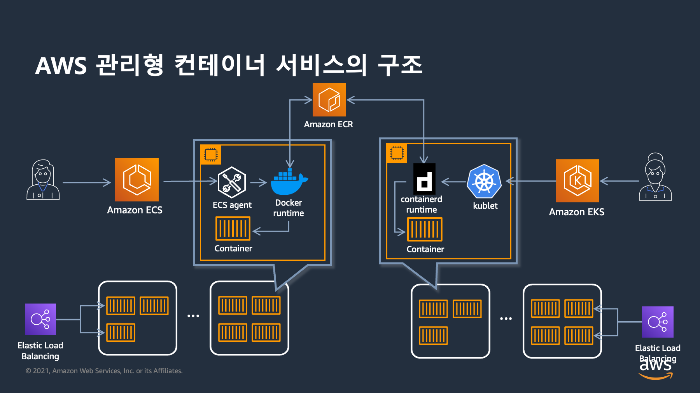
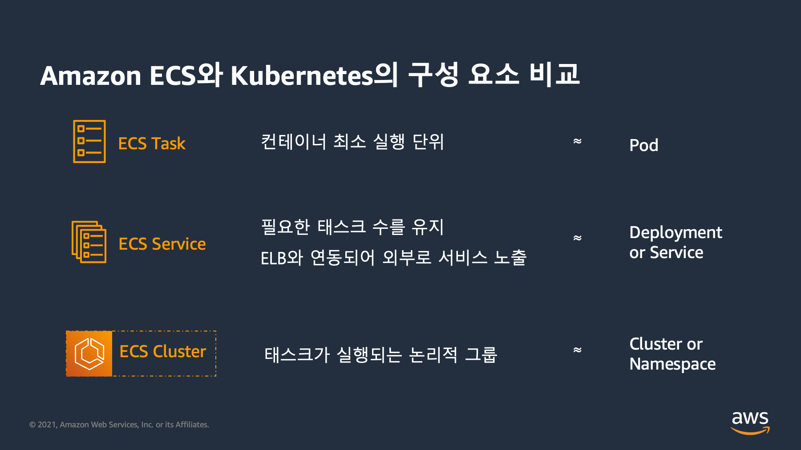

# 컨테이너 오케스트레이션 플랫폼 비교(ECS/EKS)

## AWS에서 사용할 수 있는 대표적인 컨테이너 서비스

<figure><figcaption></figcaption></figure>

## Amazon ECS / Amazon EKS 비교

<figure><figcaption></figcaption></figure>

<figure><figcaption></figcaption></figure>

## Amazon ECS / Amazon EKS 구성 요소&#x20;

<figure><figcaption></figcaption></figure>

