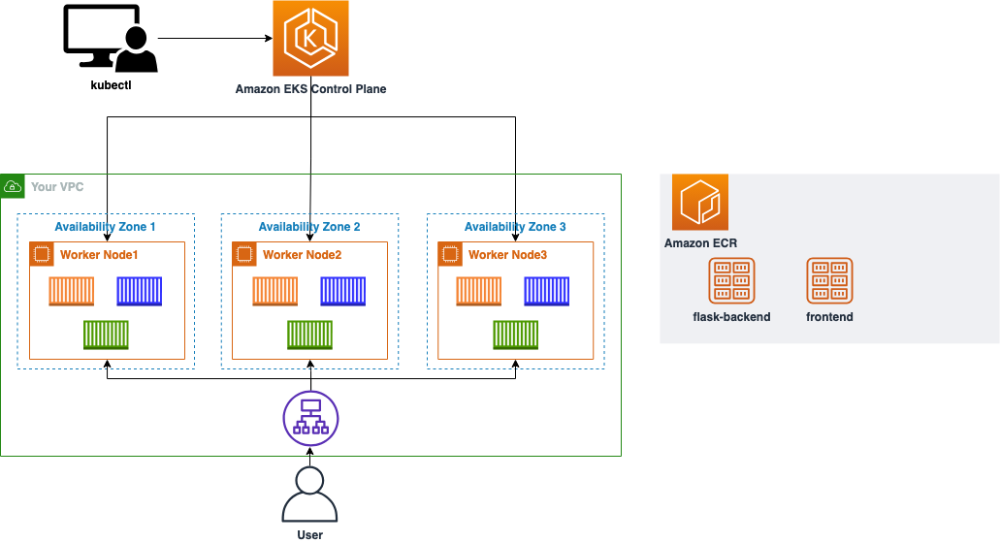

# Hands-on Lab 자료

## Amazon EKS로 웹 애플리케이션 구축하기 

**👉** [**Workshop 바로가기**](https://catalog.us-east-1.prod.workshops.aws/workshops/9c0aa9ab-90a9-44a6-abe1-8dff360ae428/ko-KR)

이 Workshop에서는 직접 컨테이너 이미지를 만들어 배포하는 것을 시작으로 Amazon EKS에 컨테이너를 배포하여 웹 페이지를 올리는 것을 목표로 합니다. 실습을 통해, 컨테이너, 쿠버네티스 그리고 Amazon EKS와 함께 사용하는 다양한 AWS 서비스들에 대해 학습합니다.

<figure><figcaption></figcaption></figure>

## ECS Cats and Dogs

**👉** [**Workshop 바로가기**](https://catalog.us-east-1.prod.workshops.aws/workshops/8c9036a7-7564-434c-b558-3588754e21f5/ko-KR)

AWS 관리 콘솔을 이용하여 Amazon ECS에 컨테이너를 배포하여 간단한 웹 페이지를 구성해봅니다. 실습을 통해 컨테이너, Amazon ECS 및 CI/CD를 위한 AWS 서비스들에 대해 학습합니다.

<figure><figcaption></figcaption></figure>
