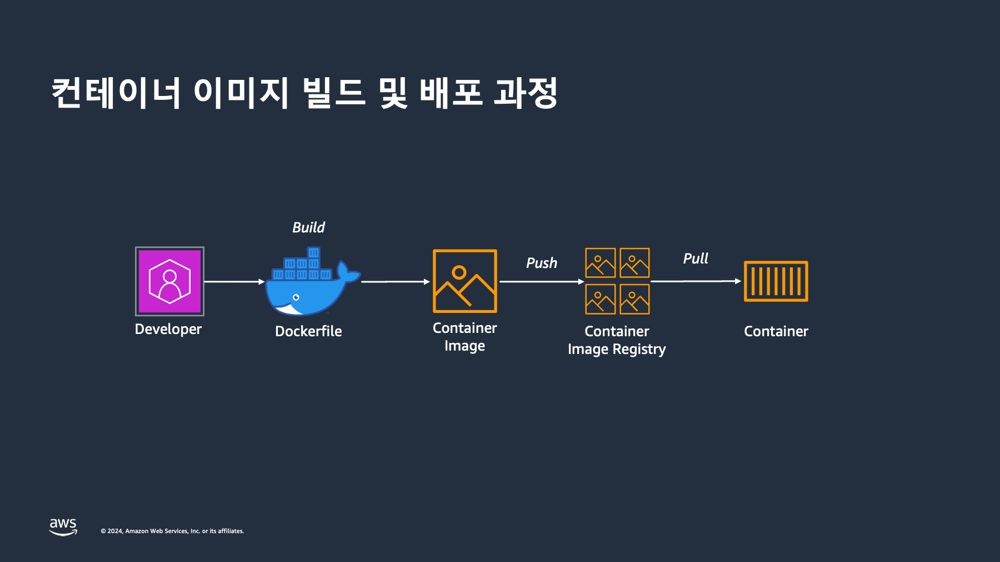
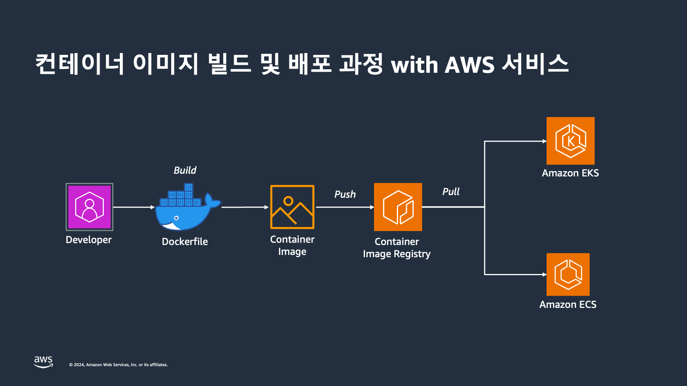
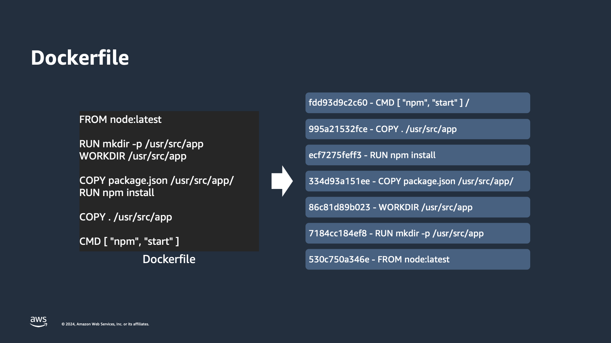
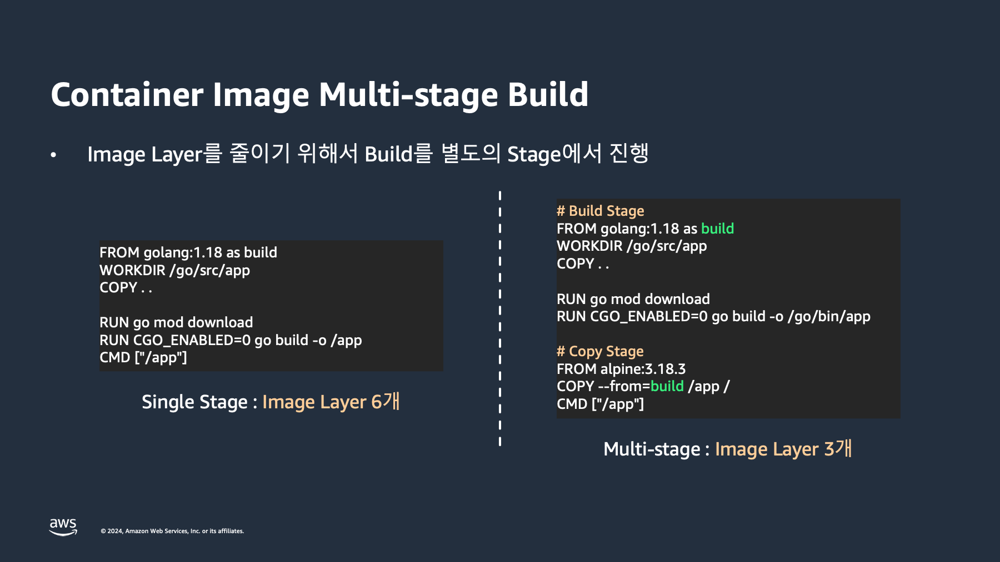
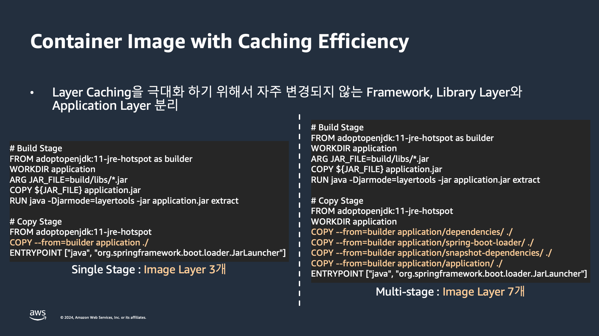
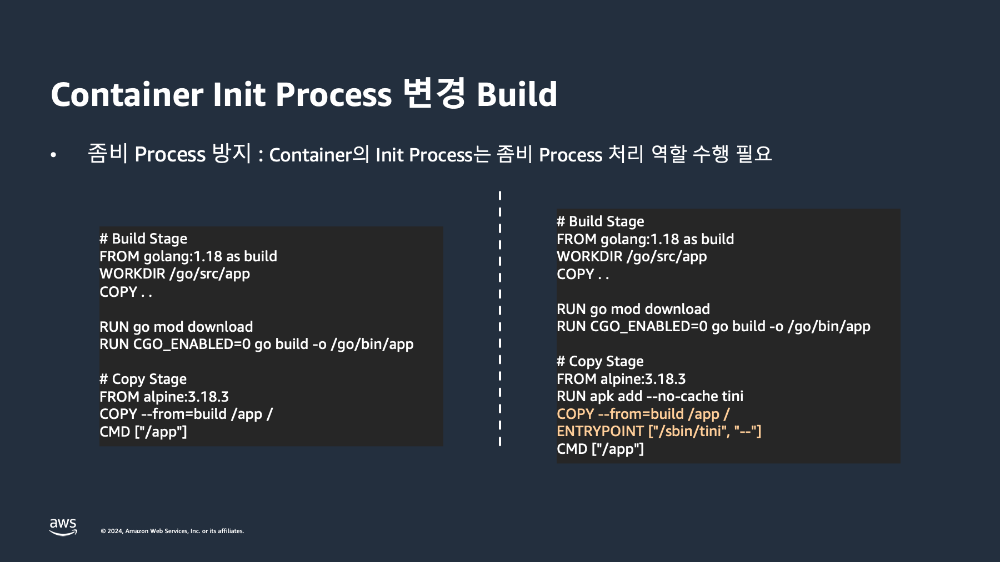
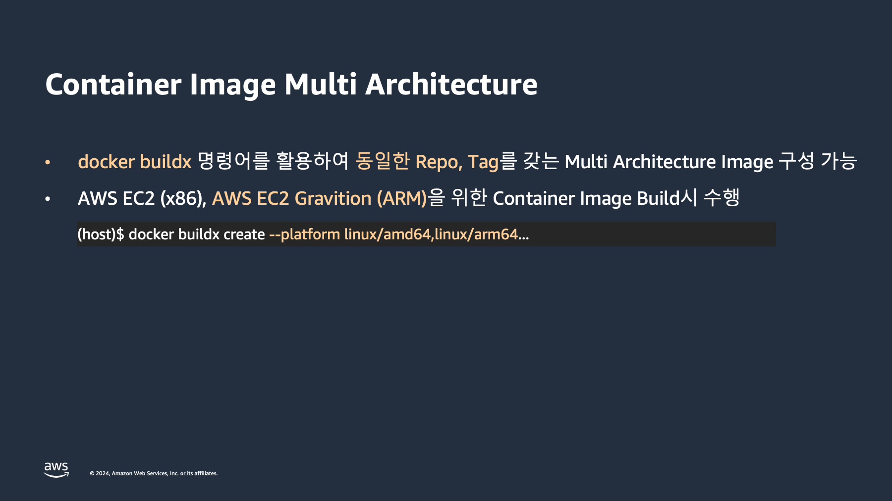

# 컨테이너 이미지 빌드 시 모범 사례

## 컨테이너 이미지 빌드 및 배포 과정

<figure><figcaption></figcaption></figure>

개발자가 애플리케이션을 컨테이너로 배포하기 위해서는 컨테이너 이미지를 빌드하고 배포하는 과정이 필요합니다. 일반적으로, 컨테이너 이미지를 빌드하기 위해서는 일반적으로 [도커](https://www.docker.com/)를 사용하게 되며, Dockerfile이라는 파일에서 해당 컨테이너 이미지를 어떻게 빌드할 것인지 명세를 작성해서 컨테이너 이미지를 빌드합니다. 해당 이미지를 컨테이너 실행 환경에 배포하기 위해서 리모트 컨테이너 이미지 저장소(Container Image Registry) 이미지를 저장(push)하고, 실제 실행환경에서 애플리케이션을 구동하기 위해 저장한 이미지를 받아(pull)와 컨테이너를 실행하게 됩니다.

<figure><figcaption></figcaption></figure>

<figure><figcaption></figcaption></figure>

## 컨테이너 이미지 빌드 시 모범 사례

1.  이미지 레이어를 최소화 하기 위해 다수의 명령어를 묶어서 실행합니다.

    <figure><figcaption></figcaption></figure>
2.  멀티 스테이지 빌드를 활용하여 이미지 레이어를 최소화합니다.

    <figure><figcaption></figcaption></figure>
3.  컨테이너 이미지 레이어 캐싱을 극대화 하기 위해 자주 변경되지 않는 Framework, Library 및 애플리케이션 레이어를 분리합니다.

    <figure><figcaption></figcaption></figure>
4.  좀비 프로세스의 방지를 위해 tini, dumb-init과 같은 도구를 활용합니다.

    <figure><figcaption></figcaption></figure>
5.  멀티 아키텍처 이미지를 빌드하여 다양한 플랫폼의 인스턴스를 활용할 수 있도록 합니다.

    <figure><figcaption></figcaption></figure>
