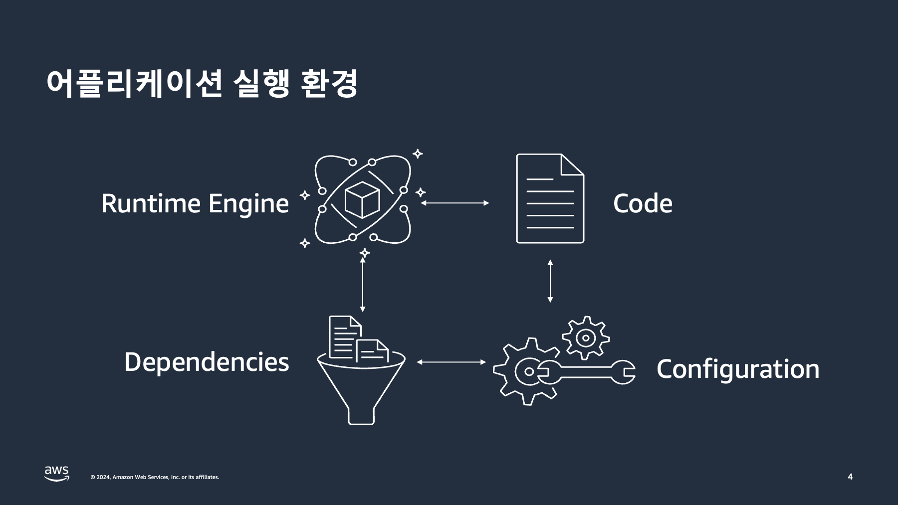
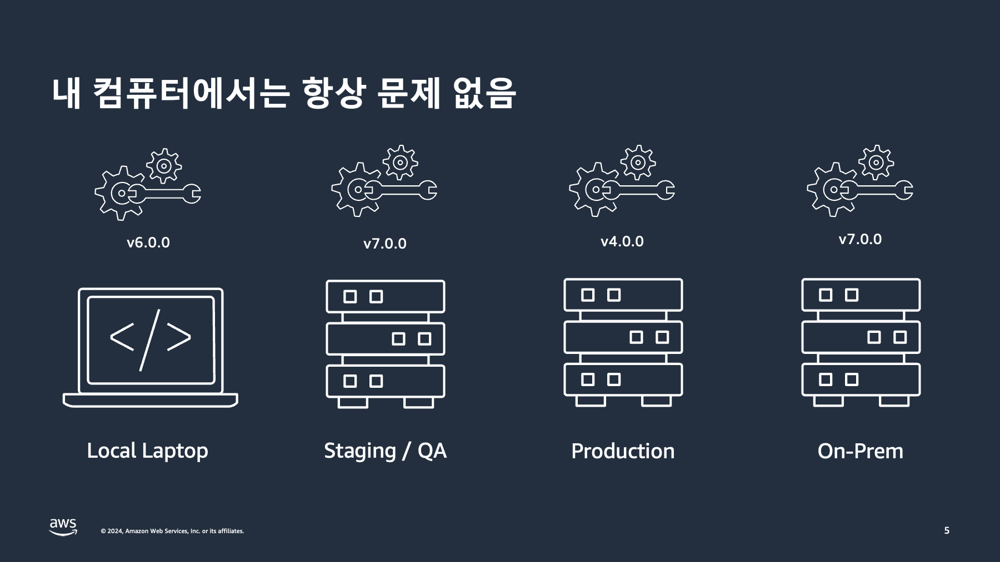
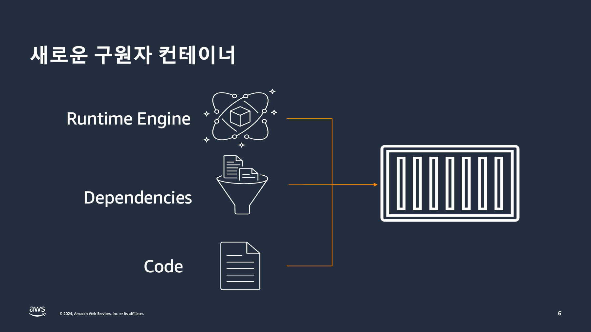
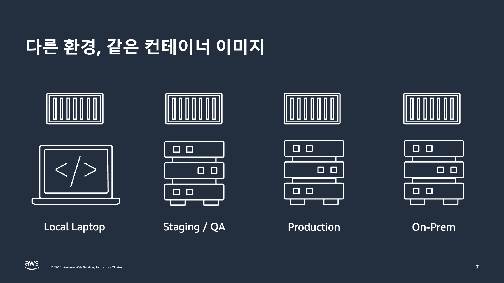
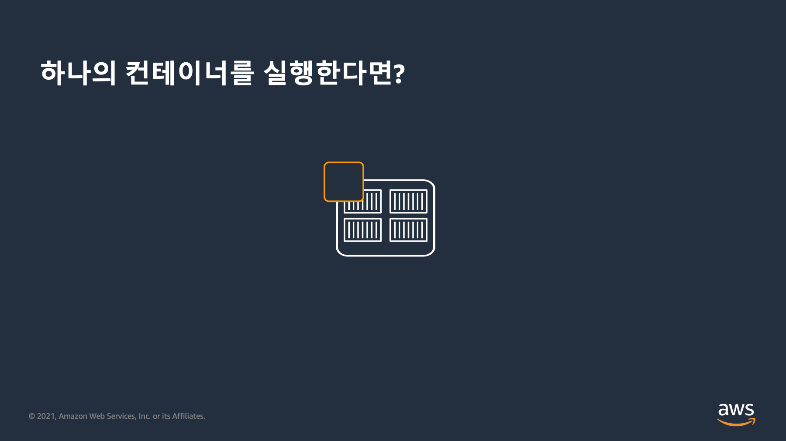
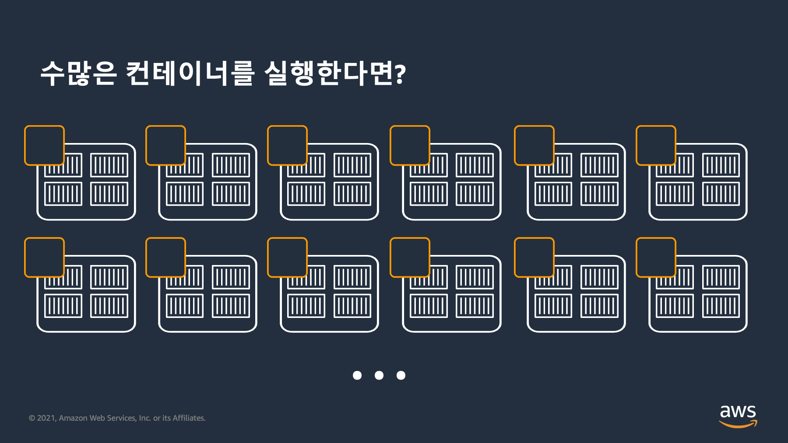
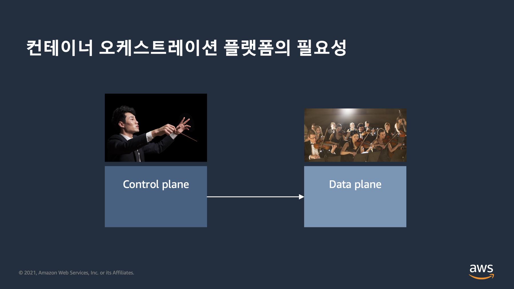
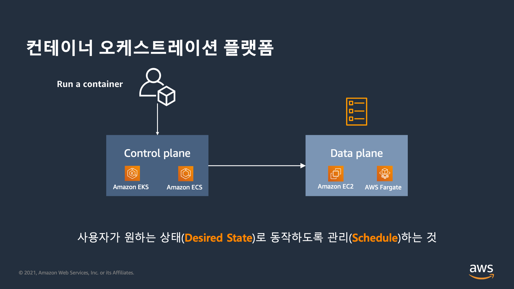

# 왜 컨테이너를 사용해야 할까?

## 왜 컨테이너를 사용해야 할까?

<figure><figcaption></figcaption></figure>

<figure><figcaption></figcaption></figure>

<figure><figcaption></figcaption></figure>

<figure><figcaption></figcaption></figure>

## 왜 컨테이너 오케스트레이션 플랫폼을 사용해야 할까?

<figure><figcaption></figcaption></figure>

<figure><figcaption></figcaption></figure>

<figure><figcaption></figcaption></figure>

<figure><figcaption></figcaption></figure>

